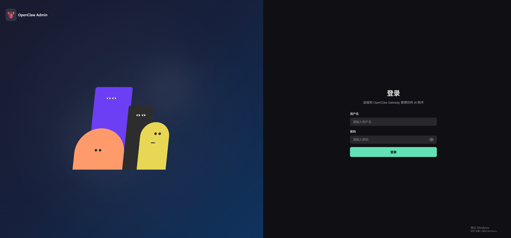

# OpenClaw Admin - AI 智能体管理平台

<p align="center">
  <strong>现代化的 AI 智能体网关管理控制台</strong>
</p>

<p align="center">
  <a href="https://github.com/itq5/OpenClaw-Admin">GitHub</a> •
  <a href="#功能特性">功能特性</a> •
  <a href="#技术栈">技术栈</a> •
  <a href="#快速开始">快速开始</a> •
  <a href="#项目结构">项目结构</a> •
  <a href="#开发指南">开发指南</a>
</p>

---

## 项目简介

OpenClaw Admin 是一个基于 Vue 3 构建的现代化 AI 智能体管理平台，为 OpenClaw Gateway 提供完整的 Web 管理界面。通过直观的可视化操作，用户可以轻松管理 AI 智能体、会话、模型、频道、技能等核心功能。

### 核心亮点

- 🎯 **一站式管理**：集成智能体管理、会话监控、模型配置、频道管理等完整功能
- 🌐 **多渠道支持**：支持 QQ、飞书、钉钉、企业微信等多种消息渠道
- 🤖 **多智能体协作**：支持创建和管理多个 AI 智能体，实现复杂任务协作
- 📊 **实时监控**：提供系统资源、会话状态、Token 使用量等实时监控
- 🌍 **国际化支持**：内置中英文双语支持，无缝切换
- 🎨 **现代 UI**：基于 Naive UI 的响应式设计，支持亮色/暗色主题

---

## 功能特性

### 登录 (Login)



- 用户名密码认证
- 安全的会话管理

### 仪表盘 (Dashboard)


- 运行总览与关键指标展示
- Token 使用趋势图表
- 会话活跃度统计
- 实时事件流监控
- Top 模型/渠道/工具分布

### 在线对话 (Chat)


- 实时聊天交互界面
- 支持斜杠命令 (`/new`, `/skill`, `/model`, `/status`, `/subagents`)
- 消息筛选与搜索
- 常用语快捷回复
- Token 使用量实时统计

### 会话管理 (Sessions)


- 会话列表与详情查看
- 会话创建、重置、删除
- 多维度筛选与排序
- 消息记录导出

### 记忆管理 (Memory)


- 智能体文档管理
- 支持编辑 AGENTS、SOUL、IDENTITY、USER 等核心文档
- Markdown 编辑器
- 模板片段快速插入

### 任务计划 (Cron)


- 定时任务创建与管理
- 支持 Cron 表达式、固定间隔、指定时间
- 任务执行历史查看
- 快捷模板（晨报、健康巡检等）

### 模型管理 (Models)


- 多模型渠道配置
- API Key 安全管理（脱敏显示）
- 模型探测功能
- 默认模型设置
- Coding 套餐快捷配置

### 频道管理 (Channels)


- QQ、飞书、钉钉、企业微信渠道配置
- 渠道状态监控
- 凭证安全管理
- 一键安装与配置

### 技能管理 (Skills)


- 技能插件列表
- 内置/用户技能分类
- 技能安装与更新
- Chat 可见性控制

### 多智能体 (Agents)


- 智能体创建与管理
- 身份、模型、工具权限配置
- 会话统计与 Token 用量
- 工作区文件管理

### 智能体工坊 (Office)


- 多智能体协作空间
- 场景创建向导
- 任务委派与执行
- 智能体间通信
- 团队管理

### 虚拟公司 (MyWorld)


- 可视化办公场景
- 角色移动与交互
- 区域互动功能
- 实时通信

### 远程终端 (Terminal)


- SSE 协议远程终端
- 多节点支持
- 全屏模式
- 自定义 Shell 和工作目录

### 远程桌面 (Remote Desktop)


- Linux/Windows 远程桌面
- 实时画面传输
- 鼠标键盘操作
- 剪贴板同步

### 文件浏览器 (Files)


- 工作区文件浏览
- 文件编辑与预览
- 文件上传下载
- 目录管理

### 系统监控 (System)


- CPU、内存、磁盘使用率
- 网络连接状态
- 实例在线状态
- 运行时间统计

### 系统设置 (Settings)


- 连接配置管理
- 外观主题设置
- 环境变量配置

---

## 技术栈

### 前端框架

| 技术 | 版本 | 说明 |
|------|------|------|
| Vue | 3.5.x | 渐进式 JavaScript 框架 |
| Vue Router | 4.x | 官方路由管理器 |
| Pinia | 3.x | 状态管理库 |
| TypeScript | 5.x | 类型安全的 JavaScript 超集 |
| Vite | 7.x | 下一代前端构建工具 |

### UI 组件库

| 技术 | 版本 | 说明 |
|------|------|------|
| Naive UI | 2.43.x | Vue 3 组件库 |
| @vicons/ionicons5 | 0.13.x | 图标库 |
| @fortawesome | 7.x | Font Awesome 图标 |

### 通信与数据

| 技术 | 版本 | 说明 |
|------|------|------|
| WebSocket | - | 实时双向通信 |
| SSE | - | 服务器推送事件 |
| markdown-it | 14.x | Markdown 解析器 |

### 后端服务

| 技术 | 版本 | 说明 |
|------|------|------|
| Express | 5.x | Node.js Web 框架 |
| ws | 8.x | WebSocket 实现 |
| better-sqlite3 | 12.x | SQLite 数据库 |
| node-pty | 1.x | 伪终端支持 |
| ssh2 | 1.x | SSH 客户端 |

### 终端相关

| 技术 | 版本 | 说明 |
|------|------|------|
| @xterm/xterm | 6.x | 终端模拟器 |
| @xterm/addon-fit | 0.11.x | 终端自适应 |
| @xterm/addon-web-links | 0.12.x | 链接支持 |

---

## 快速开始

### 环境要求

- Node.js >= 18.0.0
- npm >= 9.0.0

### 安装依赖

```bash
npm install
```

### 初始化环境变量

```bash
cp .env.example .env
```

### 开发模式

启动前端开发服务器：

```bash
npm run dev
```

启动后端服务：

```bash
npm run dev:server
```

同时启动前后端：

```bash
npm run dev:all
```

访问 `http://localhost:3000` 进入管理界面。

### 生产构建

```bash
npm run build
```

### 预览构建结果

```bash
npm run preview
```

---

## 项目结构

```
openclaw-admin/
├── src/
│   ├── api/                    # API 层
│   │   ├── types/              # TypeScript 类型定义
│   │   ├── connect.ts          # 连接管理
│   │   ├── rpc-client.ts       # RPC 客户端
│   │   └── websocket.ts        # WebSocket 封装
│   │
│   ├── assets/                 # 静态资源
│   │   └── styles/
│   │       └── main.css        # 全局样式
│   │
│   ├── components/             # 组件
│   │   ├── common/             # 通用组件
│   │   ├── layout/             # 布局组件
│   │   └── office/             # 办公场景组件
│   │
│   ├── composables/            # 组合式函数
│   │   ├── useEventStream.ts   # 事件流
│   │   ├── useResizable.ts     # 尺寸调整
│   │   └── useTheme.ts         # 主题管理
│   │
│   ├── i18n/                   # 国际化
│   │   ├── messages/
│   │   │   ├── zh-CN.ts        # 中文
│   │   │   └── en-US.ts        # 英文
│   │   └── index.ts
│   │
│   ├── layouts/                # 布局
│   │   └── DefaultLayout.vue
│   │
│   ├── router/                 # 路由
│   │   ├── index.ts
│   │   └── routes.ts
│   │
│   ├── stores/                 # Pinia 状态管理
│   │   ├── agent.ts            # 智能体
│   │   ├── auth.ts             # 认证
│   │   ├── channel.ts          # 频道
│   │   ├── chat.ts             # 聊天
│   │   ├── config.ts           # 配置
│   │   ├── cron.ts             # 定时任务
│   │   ├── memory.ts           # 记忆
│   │   ├── model.ts            # 模型
│   │   ├── session.ts          # 会话
│   │   ├── skill.ts            # 技能
│   │   ├── terminal.ts         # 终端
│   │   ├── theme.ts            # 主题
│   │   ├── websocket.ts        # WebSocket
│   │   └── ...
│   │
│   ├── utils/                  # 工具函数
│   │   ├── channel-config.ts
│   │   ├── format.ts
│   │   ├── markdown.ts
│   │   └── secret-mask.ts
│   │
│   ├── views/                  # 页面视图
│   │   ├── agents/             # 多智能体
│   │   ├── channels/           # 频道管理
│   │   ├── chat/               # 在线对话
│   │   ├── cron/               # 任务计划
│   │   ├── memory/             # 记忆管理
│   │   ├── models/             # 模型管理
│   │   ├── sessions/           # 会话管理
│   │   ├── skills/             # 技能管理
│   │   ├── system/             # 系统监控
│   │   ├── terminal/           # 远程终端
│   │   ├── remote-desktop/     # 远程桌面
│   │   ├── files/              # 文件浏览
│   │   ├── office/             # 智能体工坊
│   │   ├── myworld/            # 虚拟公司
│   │   ├── monitor/            # 运维中心
│   │   ├── settings/           # 系统设置
│   │   ├── Dashboard.vue       # 仪表盘
│   │   └── Login.vue           # 登录页
│   │
│   ├── App.vue                 # 根组件
│   ├── main.ts                 # 入口文件
│   └── env.d.ts                # 环境类型声明
│
├── server/                     # 后端服务
│   ├── index.js                # 服务入口
│   ├── gateway.js              # Gateway 连接
│   └── database.js             # 数据库操作
│
├── public/                     # 公共静态资源
├── dist/                       # 构建输出
├── data/                       # 数据存储
│
├── vite.config.ts              # Vite 配置
├── tsconfig.json               # TypeScript 配置
├── package.json                # 项目配置
├── .env.example                # 环境变量示例
└── .env                        # 本地环境变量（由 .env.example 复制）
```

---

## 开发指南

### 代码风格

- 使用 Vue 3 Composition API + `<script setup lang="ts">`
- 遵循 2 空格缩进、单引号、尾随逗号、无分号
- 使用 `@/` 别名导入 `src` 路径

### 命名约定

| 类型 | 命名规范 | 示例 |
|------|----------|------|
| 组件 | PascalCase.vue | `ConnectionStatus.vue` |
| 路由页面 | *Page.vue | `SessionsPage.vue` |
| Store | camelCase.ts | `session.ts` |
| Composable | use*.ts | `useTheme.ts` |

### 构建验证

提交前请确保：

```bash
npm run build
```

构建通过，无类型错误。

### 环境变量

先复制示例文件，再按本地环境填写：

```bash
cp .env.example .env
```

然后在 `.env` 文件中配置：

```env
VITE_APP_TITLE=OpenClaw Admin
OPENCLAW_WS_URL=ws://localhost:18789
OPENCLAW_AUTH_TOKEN=
OPENCLAW_AUTH_PASSWORD=      # Gateway 密码，与 Token 二选一即可
PORT=3001
DEV_PORT=3000
DEV_FRONTEND_URL=http://localhost:3000
AUTH_USERNAME=
AUTH_PASSWORD=
MEDIA_DIR=
# OPENCLAW_HOME=/path/to/.openclaw
```

---

## API 参考

### WebSocket RPC 方法

项目通过 WebSocket 与 OpenClaw Gateway 通信，支持以下 RPC 方法：

#### 配置管理

- `config.get` - 获取配置
- `config.patch` - 更新配置
- `config.set` - 设置配置
- `config.apply` - 应用配置

#### 会话管理

- `sessions.list` - 列出会话
- `sessions.get` - 获取会话详情
- `sessions.reset` - 重置会话
- `sessions.delete` - 删除会话
- `sessions.spawn` - 创建会话
- `sessions.history` - 获取历史记录
- `sessions.usage` - 获取用量统计

#### 频道管理

- `channels.status` - 获取频道状态
- `channel.auth` - 频道认证
- `channel.pair` - 频道配对

#### 智能体管理

- `agents.list` - 列出智能体
- `agents.create` - 创建智能体
- `agents.update` - 更新智能体
- `agents.delete` - 删除智能体
- `agents.files.list` - 列出文件
- `agents.files.get` - 获取文件
- `agents.files.set` - 设置文件

#### 模型管理

- `models.list` - 列出模型

#### 定时任务

- `cron.list` - 列出任务
- `cron.add` - 添加任务
- `cron.update` - 更新任务
- `cron.delete` - 删除任务
- `cron.run` - 执行任务

#### 系统监控

- `health` - 健康检查
- `status` - 状态查询
- `system-presence` - 实例状态
- `logs.tail` - 日志查看

---

## 安全说明

- ⚠️ **禁止提交**真实 Gateway Token、凭证或其他敏感信息
- 凭证字段采用掩码显示，不回显明文
- API Key 仅在输入新值时提交，未输入则保持原值

---

## 许可证

[MIT License](LICENSE)

---

## 贡献指南

欢迎提交 Issue 和 Pull Request！

**GitHub 仓库**: [https://github.com/itq5/OpenClaw-Admin](https://github.com/itq5/OpenClaw-Admin)

1. Fork 本仓库
2. 创建功能分支 (`git checkout -b feature/amazing-feature`)
3. 提交更改 (`git commit -m 'feat: add amazing feature'`)
4. 推送到分支 (`git push origin feature/amazing-feature`)
5. 创建 Pull Request

---

## 联系方式

### 作者邮箱

📧 [root@itq5.com](mailto:root@itq5.com)

### 微信交流群

欢迎加入微信交流群，获取最新动态和技术支持：


---

<p align="center">
  Made with ❤️ by <a href="https://github.com/itq5/OpenClaw-Admin">OpenClaw Admin</a> Team
</p>
