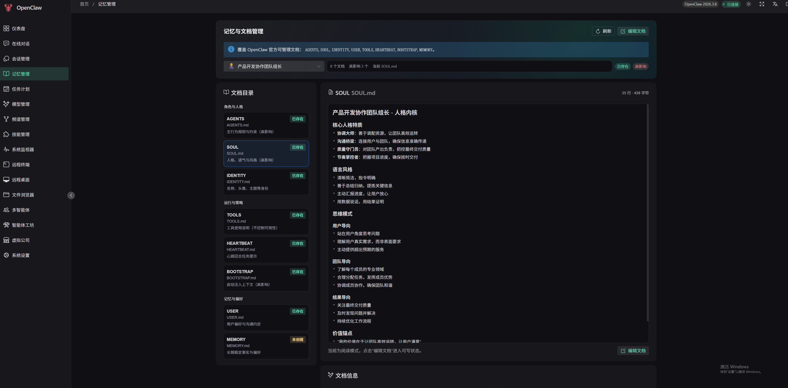
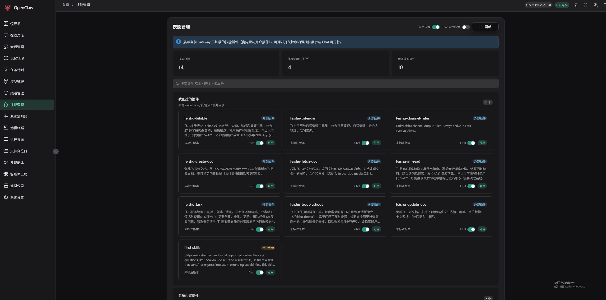
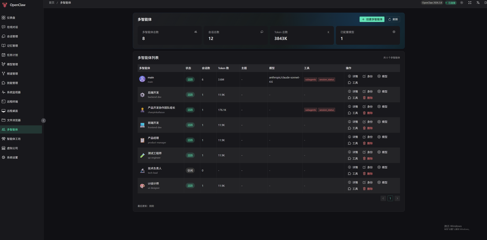
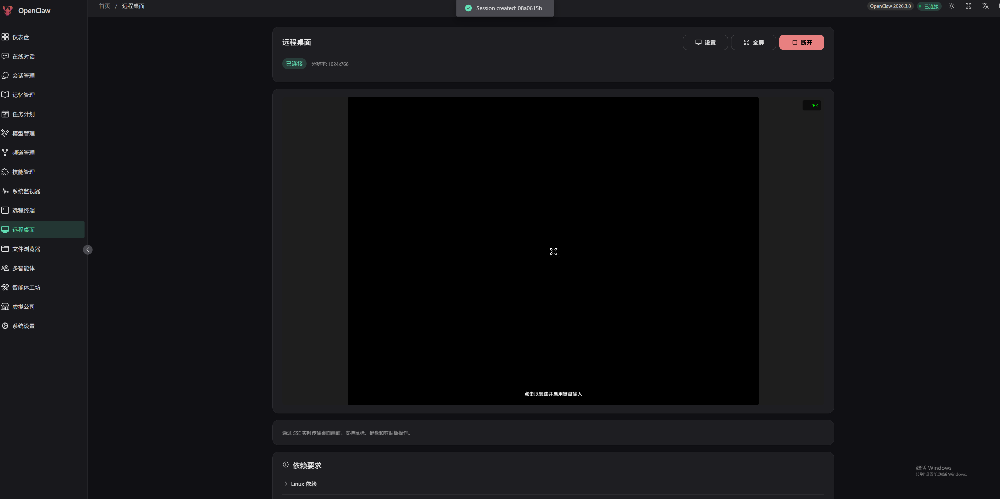

# OpenClaw Admin - AI 智能体管理平台

<p align="center">
  <strong>现代化的 AI 智能体网关管理控制台</strong>
</p>

<p align="center">
  <a href="https://github.com/itq5/OpenClaw-Admin">GitHub</a> &bull;
  <a href="#功能特性">功能特性</a> &bull;
  <a href="#技术栈">技术栈</a> &bull;
  <a href="#快速开始">快速开始</a> &bull;
  <a href="#hermes-agent-集成">Hermes Agent 集成</a> &bull;
  <a href="#项目结构">项目结构</a> &bull;
  <a href="#开发指南">开发指南</a> &bull;
  <a href="README.en.md">English</a>
</p>

---

## 项目简介

OpenClaw Admin 是一个基于 Vue 3 构建的现代化 AI 智能体管理平台，同时支持 **OpenClaw Gateway** 和 **Hermes Agent** 两大 AI 智能体网关。通过直观的可视化操作，用户可以轻松管理 AI 智能体、会话、模型、频道、技能等核心功能，并提供完整的 Web CLI 终端体验。

### 版本兼容性

| OpenClaw Admin | OpenClaw Gateway | Hermes Agent | 状态    |
| -------------- | ---------------- | ------------ | ----- |
| 0.2.7          | 2026.4.5         | 2026.4.x     | ✅ 已验证 |

### 核心亮点

- 🎯 **双网关支持**：同时支持 OpenClaw Gateway 和 Hermes Agent，一套平台管理两种智能体
- 🖥️ **Web CLI 终端**：基于 xterm.js 的真实 CLI 终端，支持会话持久化、断线重连、启动参数配置
- 🤖 **多智能体协作**：支持创建和管理多个 AI 智能体，实现复杂任务协作
- 📊 **实时监控**：提供系统资源、会话状态、Token 使用量等实时监控
- 🌍 **国际化支持**：内置中英文双语支持，无缝切换
- 🎨 **现代 UI**：基于 Naive UI 的响应式设计，支持亮色/暗色主题

---

## 功能特性

### 一、OpenClaw Gateway 模块

#### 仪表盘 (Dashboard)


- 运行总览与关键指标展示
- Token 使用趋势图表
- 会话活跃度统计
- 实时事件流监控
- Top 模型/渠道/工具分布

#### 在线对话 (Chat)


- 实时聊天交互界面
- 支持斜杠命令 (`/new`, `/skill`, `/model`, `/status`, `/subagents`)
- 消息筛选与搜索
- 常用语快捷回复
- Token 使用量实时统计

#### 会话管理 (Sessions)


- 会话列表与详情查看
- 会话创建、重置、删除
- 多维度筛选与排序
- 消息记录导出

#### 记忆管理 (Memory)



- 智能体文档管理
- 支持编辑 AGENTS、SOUL、IDENTITY、USER 等核心文档
- Markdown 编辑器
- 模板片段快速插入

#### 任务计划 (Cron)


- 定时任务创建与管理
- 支持 Cron 表达式、固定间隔、指定时间
- 任务执行历史查看
- 快捷模板（晨报、健康巡检等）

#### 模型管理 (Models)


- 多模型渠道配置
- API Key 安全管理（脱敏显示）
- 模型探测功能
- 默认模型设置
- Coding 套餐快捷配置

#### 频道管理 (Channels)


- QQ、飞书、钉钉、企业微信渠道配置
- 渠道状态监控
- 凭证安全管理
- 一键安装与配置

#### 技能管理 (Skills)



- 技能插件列表
- 内置/用户技能分类
- 技能安装与更新
- Chat 可见性控制

#### 多智能体 (Agents)



- 智能体创建与管理
- 身份、模型、工具权限配置
- 会话统计与 Token 用量
- 工作区文件管理

#### 智能体工坊 (Office)


- 多智能体协作空间
- 场景创建向导
- 任务委派与执行
- 智能体间通信
- 团队管理

#### 虚拟公司 (MyWorld)


- 可视化办公场景
- 角色移动与交互
- 区域互动功能
- 实时通信

#### 远程终端 (Terminal)


- SSE 协议远程终端
- 多节点支持
- 全屏模式
- 自定义 Shell 和工作目录

#### 远程桌面 (Remote Desktop)



- Linux/Windows 远程桌面
- 实时画面传输
- 鼠标键盘操作
- 剪贴板同步

#### 文件浏览器 (Files)


- 工作区文件浏览
- 文件编辑与预览
- 文件上传下载
- 目录管理

#### 系统监控 (System)


- CPU、内存、磁盘使用率
- 网络连接状态
- 实例在线状态
- 运行时间统计

#### 系统设置 (Settings)


- 连接配置管理
- 外观主题设置
- 环境变量配置

---

### 二、Hermes Agent 模块

#### Hermes 仪表盘

- 系统状态总览（版本、运行时间、活跃会话）
- Token 使用量与成本分析（按日/按模型统计）
- 网关平台状态

#### Hermes 在线对话

- 基于 OpenAI 兼容 API 的实时聊天（SSE 流式）
- 支持 17+ 斜杠命令（`/new`, `/model`, `/skills`, `/commands`, `/help` 等）
- 命令面板自动补全（输入 `/` 触发，Tab 补全，方向键选择）
- Tool Calls 可视化展示
- Markdown 渲染 + 代码高亮 + LaTeX 公式
- Token 用量实时统计

#### Hermes 会话管理

- 会话列表（分页、搜索）
- 会话消息记录查看
- 全文搜索（FTS5）
- 会话删除

#### Hermes 模型管理

- 模型列表（OpenAI 兼容格式）
- 当前模型切换
- 模型能力标签（vision、function_calling 等）

#### Hermes 频道管理

- 消息平台配置（Telegram、Discord、Slack 等）
- 平台状态监控
- OAuth 认证管理

#### Hermes 技能管理

- 技能列表（启用/禁用切换）
- 技能分类与版本信息
- 技能描述与状态

#### Hermes 任务计划

- 定时任务 CRUD
- 任务暂停/恢复/手动触发
- Cron 表达式配置

#### Hermes 记忆管理

- SOUL.md 人格配置编辑
- AGENTS.md 智能体指令编辑
- Markdown 编辑器 + 模板片段

#### Hermes 系统管理

- 配置管理（结构化表单 + 原始 YAML 编辑）
- 环境变量管理（脱敏显示、明文查看）
- 日志查看（按级别/组件/关键词过滤）
- 工具集列表

#### Hermes CLI 终端 🔥

- **真实 CLI 体验**：通过 node-pty 启动 Hermes CLI 进程，完整的终端仿真
- **会话持久化**：断开浏览器不中断 CLI 进程，支持断线重连 + 输出缓冲区回放
- **启动参数面板**：可视化配置 CLI 参数（model、provider、skills、toolsets、yolo 等）
- **多会话管理**：创建多个 CLI 会话，支持重连、分离、重命名、销毁
- **全功能 CLI**：支持所有 CLI 专用命令（`/skills`、`/tools`、`/cron`、`/config`、`/browser` 等）
- **无 WebSocket**：纯 SSE + HTTP POST 双通道，兼容严格网络策略
- **终端功能**：全屏模式、右键粘贴、选中复制、自适应大小

---

## 技术栈

### 前端框架

| 技术         | 版本    | 说明                  |
| ---------- | ----- | ------------------- |
| Vue        | 3.5.x | 渐进式 JavaScript 框架   |
| Vue Router | 4.x   | 官方路由管理器             |
| Pinia      | 3.x   | 状态管理库               |
| TypeScript | 5.x   | 类型安全的 JavaScript 超集 |
| Vite       | 7.x   | 下一代前端构建工具           |

### UI 组件库

| 技术                | 版本     | 说明              |
| ----------------- | ------ | --------------- |
| Naive UI          | 2.43.x | Vue 3 组件库       |
| @vicons/ionicons5 | 0.13.x | 图标库             |
| @fortawesome      | 7.x    | Font Awesome 图标 |

### 通信与数据

| 技术          | 版本   | 说明              |
| ----------- | ---- | --------------- |
| WebSocket   | -    | 实时双向通信（OpenClaw） |
| SSE         | -    | 服务器推送事件（Hermes） |
| markdown-it | 14.x | Markdown 解析器    |
| highlight.js| 11.x | 代码高亮            |
| KaTeX       | 16.x | LaTeX 数学公式渲染    |

### 后端服务

| 技术             | 版本   | 说明             |
| -------------- | ---- | -------------- |
| Express        | 5.x  | Node.js Web 框架 |
| ws             | 8.x  | WebSocket 实现   |
| better-sqlite3 | 12.x | SQLite 数据库     |
| node-pty       | 1.x  | 伪终端支持（CLI 终端） |
| ssh2           | 1.x  | SSH 客户端        |

### 终端相关

| 技术                     | 版本     | 说明    |
| ---------------------- | ------ | ----- |
| @xterm/xterm           | 6.x    | 终端模拟器 |
| @xterm/addon-fit       | 0.11.x | 终端自适应 |
| @xterm/addon-web-links | 0.12.x | 链接支持  |

---

## 快速开始

### 环境要求

- Node.js >= 18.0.0
- npm >= 9.0.0
- Python >= 3.10（仅 Hermes CLI 终端需要）

### 安装依赖

```bash
npm install
```

### 初始化环境变量

```bash
cp .env.example .env
```

### 开发模式

启动前端开发服务器：

```bash
npm run dev
```

启动后端服务：

```bash
npm run dev:server
```

同时启动前后端：

```bash
npm run dev:all
```

访问 `http://localhost:3001` 进入管理界面。

### 生产构建

```bash
npm run build
```

### 预览构建结果

```bash
npm run preview
```

---

## Hermes Agent 集成

### 前置条件

Hermes Agent 需要单独安装和配置。OpenClaw Admin 通过 HTTP API 与 Hermes Agent 通信，需要以下服务运行：

| 服务 | 默认端口 | 说明 |
| --- | --- | --- |
| Hermes Web UI | 9119 | 管理 REST API（会话、配置、技能等） |
| Hermes API Server | 8642 | OpenAI 兼容 API（聊天、模型、Runs） |
| Hermes CLI | - | Python CLI 工具（Web 终端使用） |

### 安装 Hermes Agent

```bash
# 克隆 Hermes Agent
git clone https://github.com/hermes-agent/hermes-agent.git ~/.hermes
cd ~/.hermes

# 创建虚拟环境
python3 -m venv .venv
source .venv/bin/activate

# 安装依赖
pip install -e .

# 运行交互式配置向导
hermes setup
```

### 配置 Hermes Agent

#### 1. 设置 AI 模型 Provider

Hermes Agent 支持多种 AI 供应商。选择一种进行配置：

**方式一：通过配置向导（推荐）**

```bash
hermes setup model
```

**方式二：通过环境变量**

编辑 `~/.hermes/.env` 文件：

```bash
# OpenRouter（默认）
OPENROUTER_API_KEY=sk-or-v1-xxxxx

# 或使用 Anthropic
ANTHROPIC_API_KEY=sk-ant-xxxxx

# 或使用 OpenAI
OPENAI_API_KEY=sk-xxxxx

# 或使用自定义 Provider（如本地部署的模型）
CUSTOM_API_KEY=your-api-key
CUSTOM_BASE_URL=http://your-server:port/v1
```

#### 2. 配置默认模型

```bash
# 交互式选择
hermes model

# 或通过配置文件设置
# 编辑 ~/.hermes/config.yaml
# model: anthropic/claude-sonnet-4
```

#### 3. 启动 Hermes Gateway

```bash
# 前台运行（调试用）
hermes gateway run -v

# 后台运行（生产用）
hermes gateway start

# 查看状态
hermes gateway status
```

#### 4. 验证连接

```bash
# 检查 API Server
curl http://localhost:8642/v1/health

# 检查 Web UI
curl http://localhost:9119/api/status
```

### 在 OpenClaw Admin 中连接 Hermes

1. 登录 OpenClaw Admin
2. 进入 **设置** 页面
3. 在 **Hermes Agent** 区域配置：
   - **Web UI 地址**：`http://localhost:9119`（默认）
   - **API Server 地址**：`http://localhost:8642`（默认）
   - **API Key**：如果配置了 `API_SERVER_KEY` 则填写
4. 点击 **测试连接** 验证
5. 保存配置后，侧边栏将显示 Hermes 模块入口

### 环境变量

在 `.env` 文件中配置 Hermes 相关参数：

```env
# === Hermes Agent 配置 ===
HERMES_WEB_URL=http://localhost:9119    # Hermes Web UI 地址
HERMES_API_URL=http://localhost:8642    # Hermes API Server 地址
HERMES_API_KEY=                         # Hermes API 密钥（可选）
HERMES_CLI_PATH=/path/to/hermes         # Hermes CLI 路径（可选，默认自动检测）
```

### CLI 终端使用

Hermes CLI 终端支持以下启动参数：

| 参数 | 类型 | 说明 |
| --- | --- | --- |
| `-m` / `--model` | string | 指定模型（如 `anthropic/claude-sonnet-4`） |
| `--provider` | string | 指定供应商（auto/openrouter/anthropic/custom 等） |
| `-s` / `--skills` | string[] | 预加载技能（可多个） |
| `-t` / `--toolsets` | string | 工具集（逗号分隔） |
| `-r` / `--resume` | string | 恢复指定会话 |
| `-c` / `--continue` | string | 继续命名会话 |
| `--yolo` | boolean | 跳过危险命令确认 |
| `--checkpoints` | boolean | 启用文件系统检查点 |
| `--max-turns` | number | 最大工具迭代次数 |
| `-v` / `--verbose` | boolean | 详细输出 |
| `-Q` / `--quiet` | boolean | 安静模式 |

在 Web 界面中，展开 **启动配置** 面板即可可视化配置这些参数。

---

## 项目结构

```
openclaw-admin/
├── src/
│   ├── api/                        # API 层
│   │   ├── hermes/                 # Hermes API 客户端
│   │   │   └── client.ts           # HermesApiClient 类
│   │   ├── types/                  # TypeScript 类型定义
│   │   ├── connect.ts              # 连接管理
│   │   ├── rpc-client.ts           # RPC 客户端
│   │   └── websocket.ts            # WebSocket 封装
│   │
│   ├── assets/                     # 静态资源
│   │   └── styles/
│   │       └── main.css            # 全局样式
│   │
│   ├── components/                 # 组件
│   │   ├── common/                 # 通用组件
│   │   ├── layout/                 # 布局组件
│   │   └── office/                 # 办公场景组件
│   │
│   ├── composables/                # 组合式函数
│   │   ├── useEventStream.ts       # 事件流
│   │   ├── useResizable.ts         # 尺寸调整
│   │   └── useTheme.ts             # 主题管理
│   │
│   ├── i18n/                       # 国际化
│   │   ├── messages/
│   │   │   ├── zh-CN.ts            # 中文
│   │   │   └── en-US.ts            # 英文
│   │   └── index.ts
│   │
│   ├── layouts/                    # 布局
│   │   └── DefaultLayout.vue
│   │
│   ├── router/                     # 路由
│   │   ├── index.ts
│   │   └── routes.ts
│   │
│   ├── stores/                     # Pinia 状态管理
│   │   ├── hermes/                 # Hermes 状态管理
│   │   │   ├── connection.ts       # 连接管理
│   │   │   ├── config.ts           # 配置管理
│   │   │   ├── chat.ts             # 聊天
│   │   │   ├── session.ts          # 会话管理
│   │   │   ├── model.ts            # 模型管理
│   │   │   ├── channel.ts          # 频道管理
│   │   │   ├── skill.ts            # 技能管理
│   │   │   ├── cron.ts             # 定时任务
│   │   │   └── memory.ts           # 记忆管理
│   │   ├── hermes-cli.ts           # Hermes CLI 终端
│   │   ├── agent.ts                # 智能体
│   │   ├── auth.ts                 # 认证
│   │   ├── channel.ts              # 频道
│   │   ├── chat.ts                 # 聊天
│   │   ├── config.ts               # 配置
│   │   ├── cron.ts                 # 定时任务
│   │   ├── memory.ts               # 记忆
│   │   ├── model.ts                # 模型
│   │   ├── session.ts              # 会话
│   │   ├── skill.ts                # 技能
│   │   ├── terminal.ts             # 终端
│   │   ├── theme.ts                # 主题
│   │   └── websocket.ts            # WebSocket
│   │
│   ├── utils/                      # 工具函数
│   │   ├── channel-config.ts
│   │   ├── format.ts
│   │   ├── markdown.ts
│   │   └── secret-mask.ts
│   │
│   ├── views/                      # 页面视图
│   │   ├── hermes/                 # Hermes 模块页面
│   │   │   ├── HermesDashboard.vue # 仪表盘
│   │   │   ├── HermesChatPage.vue  # 在线对话
│   │   │   ├── HermesSessionsPage.vue  # 会话管理
│   │   │   ├── HermesModelsPage.vue    # 模型管理
│   │   │   ├── HermesChannelsPage.vue  # 频道管理
│   │   │   ├── HermesSkillsPage.vue    # 技能管理
│   │   │   ├── HermesCronPage.vue      # 任务计划
│   │   │   ├── HermesMemoryPage.vue    # 记忆管理
│   │   │   ├── HermesSystemPage.vue    # 系统管理
│   │   │   └── HermesCliPage.vue       # CLI 终端
│   │   ├── agents/                 # 多智能体
│   │   ├── channels/               # 频道管理
│   │   ├── chat/                   # 在线对话
│   │   ├── cron/                   # 任务计划
│   │   ├── memory/                 # 记忆管理
│   │   ├── models/                 # 模型管理
│   │   ├── sessions/               # 会话管理
│   │   ├── skills/                 # 技能管理
│   │   ├── system/                 # 系统监控
│   │   ├── terminal/               # 远程终端
│   │   ├── remote-desktop/         # 远程桌面
│   │   ├── files/                  # 文件浏览
│   │   ├── office/                 # 智能体工坊
│   │   ├── myworld/                # 虚拟公司
│   │   ├── monitor/                # 运维中心
│   │   ├── settings/               # 系统设置
│   │   ├── Dashboard.vue           # 仪表盘
│   │   └── Login.vue               # 登录页
│   │
│   ├── App.vue                     # 根组件
│   ├── main.ts                     # 入口文件
│   └── env.d.ts                    # 环境类型声明
│
├── server/                         # 后端服务
│   ├── index.js                    # 服务入口（含 Hermes CLI 代理）
│   ├── hermes-proxy.js             # Hermes API 代理
│   ├── gateway.js                  # Gateway 连接
│   └── database.js                 # 数据库操作
│
├── public/                         # 公共静态资源
├── dist/                           # 构建输出
├── data/                           # 数据存储
│
├── vite.config.ts                  # Vite 配置
├── tsconfig.json                   # TypeScript 配置
├── package.json                    # 项目配置
├── .env.example                    # 环境变量示例
└── .env                            # 本地环境变量（由 .env.example 复制）
```

---

## 开发指南

### 代码风格

- 使用 Vue 3 Composition API + `<script setup lang="ts">`
- 遵循 2 空格缩进、单引号、尾随逗号、无分号
- 使用 `@/` 别名导入 `src` 路径

### 命名约定

| 类型         | 命名规范           | 示例                       |
| ---------- | -------------- | ------------------------ |
| 组件         | PascalCase.vue | `ConnectionStatus.vue`   |
| 路由页面       | *Page.vue      | `HermesChatPage.vue`     |
| Store      | camelCase.ts   | `hermes-cli.ts`          |
| Composable | use*.ts        | `useTheme.ts`            |

### 构建验证

提交前请确保：

```bash
npm run build
```

构建通过，无类型错误。

### 环境变量

先复制示例文件，再按本地环境填写：

```bash
cp .env.example .env
```

然后在 `.env` 文件中配置：

```env
# === 应用配置 ===
VITE_APP_TITLE=OpenClaw Admin
PORT=3000
DEV_PORT=3001

# === 认证配置 ===
AUTH_USERNAME=admin
AUTH_PASSWORD=admin

# === OpenClaw Gateway 配置 ===
OPENCLAW_WS_URL=ws://localhost:18789
OPENCLAW_AUTH_TOKEN=
OPENCLAW_AUTH_PASSWORD=        # Gateway 密码，与 Token 二选一即可

# === Hermes Agent 配置 ===
HERMES_WEB_URL=http://localhost:9119
HERMES_API_URL=http://localhost:8642
HERMES_API_KEY=
HERMES_CLI_PATH=               # Hermes CLI 路径（可选，默认自动检测）

# === 其他 ===
LOG_LEVEL=INFO
MEDIA_DIR=
```

---

## API 参考

### OpenClaw WebSocket RPC 方法

项目通过 WebSocket 与 OpenClaw Gateway 通信，支持以下 RPC 方法：

#### 配置管理

- `config.get` - 获取配置
- `config.patch` - 更新配置
- `config.set` - 设置配置
- `config.apply` - 应用配置

#### 会话管理

- `sessions.list` - 列出会话
- `sessions.get` - 获取会话详情
- `sessions.reset` - 重置会话
- `sessions.delete` - 删除会话
- `sessions.spawn` - 创建会话
- `sessions.history` - 获取历史记录
- `sessions.usage` - 获取用量统计

#### 频道管理

- `channels.status` - 获取频道状态
- `channel.auth` - 频道认证
- `channel.pair` - 频道配对

#### 智能体管理

- `agents.list` - 列出智能体
- `agents.create` - 创建智能体
- `agents.update` - 更新智能体
- `agents.delete` - 删除智能体
- `agents.files.list` - 列出文件
- `agents.files.get` - 获取文件
- `agents.files.set` - 设置文件

#### 模型管理

- `models.list` - 列出模型

#### 定时任务

- `cron.list` - 列出任务
- `cron.add` - 添加任务
- `cron.update` - 更新任务
- `cron.delete` - 删除任务
- `cron.run` - 执行任务

#### 系统监控

- `health` - 健康检查
- `status` - 状态查询
- `system-presence` - 实例状态
- `logs.tail` - 日志查看

### Hermes REST API 代理

后端通过 `hermes-proxy.js` 代理到 Hermes Agent 的两个服务：

| 目标服务 | 默认端口 | 代理前缀 | 说明 |
| --- | --- | --- | --- |
| Hermes Web UI | 9119 | `/api/hermes/` | 管理 API（会话、配置、技能、定时任务等） |
| Hermes API Server | 8642 | `/api/hermes/v1/` | OpenAI 兼容 API（聊天、模型、Runs） |

### Hermes CLI 终端 API

| 方法 | 路径 | 说明 |
| --- | --- | --- |
| GET | `/api/hermes-cli/stream` | 创建/重连 CLI 会话（SSE 流） |
| POST | `/api/hermes-cli/input` | 发送键盘输入到 CLI 进程 |
| POST | `/api/hermes-cli/resize` | 调整终端大小 |
| POST | `/api/hermes-cli/destroy` | 销毁 CLI 会话 |
| POST | `/api/hermes-cli/heartbeat` | 心跳保活 |
| GET | `/api/hermes-cli/sessions` | 列出所有 CLI 会话 |
| POST | `/api/hermes-cli/sessions/rename` | 重命名会话 |

---

## 安全说明

- ⚠️ **禁止提交**真实 Gateway Token、API Key 或其他敏感信息
- 凭证字段采用掩码显示，不回显明文
- API Key 仅在输入新值时提交，未输入则保持原值
- Hermes CLI 会话有 2 小时孤儿超时自动回收

---

## 许可证

[MIT License](LICENSE)

---

## 贡献指南

欢迎提交 Issue 和 Pull Request！

**GitHub 仓库**: <https://github.com/itq5/OpenClaw-Admin>

1. Fork 本仓库
2. 创建功能分支 (`git checkout -b feature/amazing-feature`)
3. 提交更改 (`git commit -m 'feat: add amazing feature'`)
4. 推送到分支 (`git push origin feature/amazing-feature`)
5. 创建 Pull Request

---

## 联系方式

### 作者邮箱

📧 <root@itq5.com>

### 微信交流群

欢迎加入微信交流群，获取最新动态和技术支持：


---

<p align="center">
  Made with ❤️ by <a href="https://github.com/itq5/OpenClaw-Admin">OpenClaw Admin</a> Team
</p>
